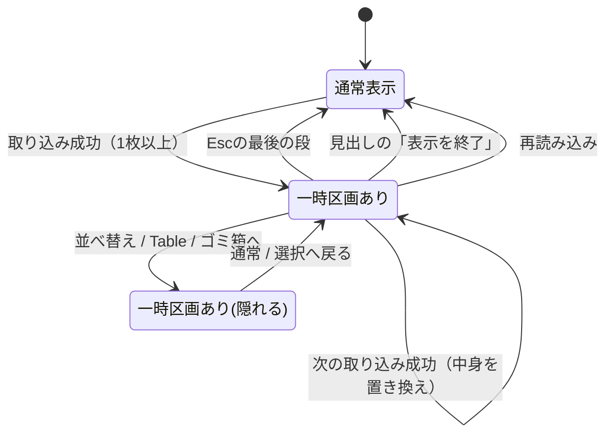
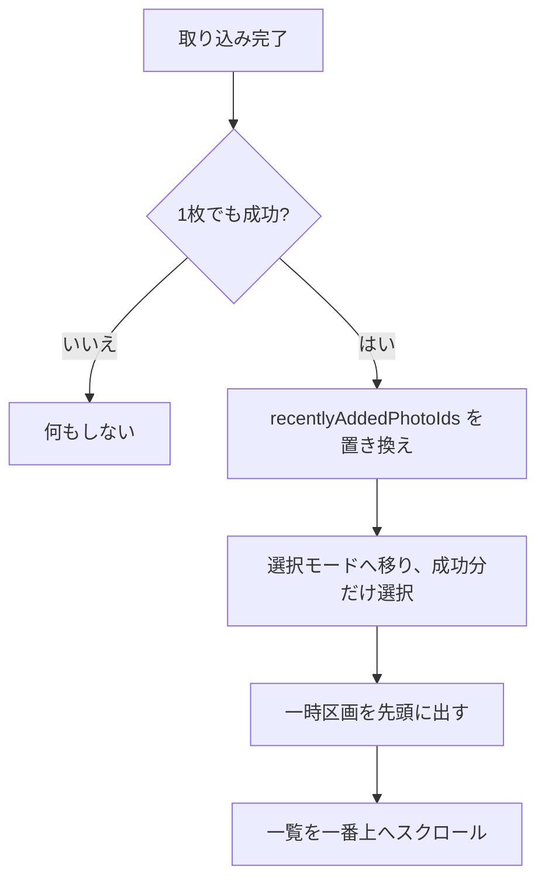

# 「今回追加」を一覧の先頭に一時表示する — 設計

**実装前の設計。この文書の時点で製品コードは1行も変えていない。**

## 目的

どの並び順を使っていても、取り込んだ写真が**一旦一覧の一番上に見える**ようにする。

**並び順のデータ（`sort_order`）と撮影日時は書き換えない。**
手で作った並びを壊さない。表示だけの一時的な区画にする。

---

# 1. いまの第1Aの状態（コードを読んで確認した事実）

| 事実 | 場所 |
|---|---|
| 取り込んだ写真のIDを `recentlyAddedPhotoIds`（Set）で保持している | `admin.tsx:435` |
| **`useState` なので再読み込みで消える**（保存していない） | 同上 |
| 新しい取り込みは、この集合を**丸ごと置き換える** | `handleFiles` の着地処理 |
| 写真タイルの左端に幅2pxの線を出している | `admin.tsx` グリッド内 |
| Escの**最後の段**でこの集合を空にする | `admin.tsx:4058` |
| 取り込み成功後は選択モードへ移り、成功分だけを選ぶ | `handleFiles` |
| 一覧は取り込み後も**動かない**（新しい写真は末尾） | — |

**新しい仕組みを足す必要はない。この集合をそのまま使える。**

## なぜ末尾に来るか（確認済み）

1. 取り込むと `sort_order` に「いまの最大値 + 1」が入る（`api/index.ts:1782`）
2. Libraryの既定の並びが「手動（保存されている順）」＝ `sort_order` の昇順

さらに、公開ギャラリーの並び順の設定は**未設定＝手動**なので、
`sort_order` は**公開サイトの並びにも使われている**。だから触ってはいけない。

---

# 2. いまの仮想グリッドの作り（事実）

```
scrollRef（data-library-scroll・スクロールする箱）
 └ 並べ替えモードの注意書き（あれば）
 └ gridRef
    ├ 上の詰め物   <div style={{height: topPadding}} />
    ├ グリッド本体 （画面に見える範囲＋前後8行だけを描画）
    └ 下の詰め物
```

- `computeVirtualGridWindow`（`admin.tsx:1606`）は
  **すべての行が同じ高さである前提**で位置を出している
- `scrollTop` は**スクロールする箱**から測っている（`measureLibraryGrid`）
- 矢印キー移動・範囲選択・`scrollLibraryIndexIntoView` は
  すべて `displayed` 配列の**添字**を使う。**添字の順序＝画面の見た目の順序**が前提

## 一時区画を入れると壊れるところ

| 壊れるもの | 理由 |
|---|---|
| 仮想スクロールの位置計算 | 見出しと一時区画の高さぶん、グリッドが下へずれる。`scrollTop` は箱から測っているので補正が要る |
| 矢印キー移動・範囲選択 | 画面の並びと `displayed` の添字がずれると、移動先が食い違う |
| `scrollLibraryIndexIntoView` | 「添字 × 行高」で位置を出しているので、上に何か挟まるとずれる |
| **並べ替えモード** | 画面の並び＝保存順、という前提でドラッグ位置を計算している。**一時区画があると並びが壊れる** |

---

# 3. 表現方法の3案

| | やり方 | 良い点 | 悪い点 |
|---|---|---|---|
| **A（推奨）** | 一時区画は**仮想化せずそのまま描画**し、その下に見出し、さらに下に**今までどおり仮想化した通常グリッド**を置く。通常グリッドへ渡す `scrollTop` から「一時区画＋見出しの実測高さ」を引く | 今の仮想スクロールの計算に手を入れない。壊れる範囲が小さい | 一度に大量に取り込むと一時区画が重くなる |
| **B** | 試作中の `virtual-sections.ts`（B-2）を本線へ入れ、区画ごとに高さが違う一覧として扱う | 理屈として正しい。将来のグループ表示にそのまま繋がる | 本線の仮想スクロールを置き換える大きな変更。画面に繋いだ実績がまだ無い |
| **C** | 見出しをスクロールの外に固定し、グリッドは1つのまま先頭に寄せる | 実装が最小 | 区切りが弱く「一時的なもの」と分かりにくい |

## 推奨: A

**理由**: 一時区画に入るのは「今回取り込んだ写真」だけなので、通常は数枚〜数十枚。
仮想化しなくても耐える。いちばんリスクの高い仮想スクロールの計算式に触らずに済む。

Bは、B-3（撮影ごとのグループ表示）を作るときに本命になる。
**今回1つの一時区画のために本線の仮想スクロールを置き換えるのは重すぎる。**

### 大量取り込みへの備え

一時区画が大きくなりすぎたときの扱いを決めておく（実装時に確定）。

- 目安として **50枚を超えたら**、一時区画は「先頭の数枚＋『他◯枚』」に畳む
- 畳んだ状態でも「今回追加だけを表示」で全部見られる

---

# 4. データの流れ（重複を出さない仕組み）

**配列を作り直すだけで、DBもAPIも触らない。**

```
allPhotos（全件・絞り込み前）
  │
  ├── recentlyAddedPhotoIds に含まれるもの ──▶ pinned（一時区画）
  │      ※ 絞り込み条件を無視して必ず出す
  │
  └── 絞り込み・検索・並べ替えを通す ──▶ displayedBase
                                          │
                                          └ pinned を取り除く ──▶ main（通常一覧）

displayed = [...pinned, ...main]   ← 矢印キー・範囲選択・⌘A はこれを見る
```

これで:

- **重複しない**。pinned に入った写真は main から取り除く
- **絞り込みの外にある写真も一時区画には出る**（オーナー指定）
- **一時区画を解除すると `pinned` が空になり、写真は本来の位置へ戻る**
- **`displayed` の添字＝画面の見た目の順序**が保たれるので、
  矢印キー・範囲選択・⌘A が今までどおり動く

仮想スクロールは `main` に対してだけ計算し、
描画時の添字に `pinned.length` を足す。

### 一時区画の中の並び

**通常一覧と同じ並び順を適用する。**
取り込んだ順は記録していない（3枚ずつ並行して送るため完了順が前後する）ので、
「取り込んだ順」は正確に再現できない。同じ並び順を使えば説明もしやすい。

---

# 5. 状態遷移



## 取り込み後の流れ



**G の「一番上へスクロール」は並び順を変えない。** 見る位置を動かすだけ。

## 消えるとき / 隠れるとき

| きっかけ | ID集合 | 一時区画 | 左端の目印 |
|---|---|---|---|
| Escの最後の段 | **空になる** | 消える | 消える |
| 見出しの「表示を終了」 | **空になる** | 消える | 消える |
| 再読み込み | **空になる**（保存していない） | 消える | 消える |
| 次の取り込み | **置き換わる** | 新しい中身 | 新しい写真へ |
| 並べ替えモードへ | **残る** | **隠れる** | 残る |
| Table / ゴミ箱へ | **残る** | **隠れる** | 残る |
| 通常 / 選択へ戻る | 残る | **また出る** | 残る |
| 写真をゴミ箱へ入れた | 一覧から消えるので自動的に外れる | その写真だけ消える | — |

**並べ替えモードで隠す理由**: 並べ替えは「画面の並び＝保存される順」を前提に
ドラッグ位置を計算している。一時区画があると**手で作った並びが壊れる**。
ID集合は残すので、通常モードへ戻れば一時区画も戻る。

---

# 6. 画面に出すもの

```
┌─────────────────────────────────────────────┐
│ 今回追加 3枚                    表示を終了 │  ← 見出し
├─────────────────────────────────────────────┤
│  ■ ■ ■                                      │  ← 一時区画（仮想化しない）
├─────────────────────────────────────────────┤
│  ■ ■ ■ ■ ■ ■ ■ ■ ■ ■ ■ ■ ■ ■ ■ ■ ■ ■   │  ← 通常一覧（今までどおり仮想化）
│  ...                                        │
└─────────────────────────────────────────────┘
```

- 見出しの文言は「今回追加 ◯枚」。短く、意味が分かるものにする
- 絞り込み中に、絞り込みの外の写真が一時区画に入っている場合は、
  その旨を短く添える（例:「絞り込みの対象外を含む」）
- **点滅や動きは付けない**（第1Aと同じ方針）

---

# 7. 決めてほしい小さな判断

実装前に決められるとよいもの。決まらなければ推奨で進める。

| # | 判断 | 選択肢 | 推奨 |
|---|---|---|---|
| 1 | 一時区画の中の並び | 通常一覧と同じ / 取り込み順（正確には再現できない） | **通常一覧と同じ** |
| 2 | Table モードでの扱い | 隠す / 先頭に行を寄せる | **隠す**（v1） |
| 3 | 大量取り込み時 | 50枚超は畳む / 全部出す | **50枚超は畳む** |
| 4 | 見出しの文言 | 「今回追加 ◯枚」/ 「取り込んだ写真 ◯枚」 | **今回追加 ◯枚** |
| 5 | 取り込み後に一番上へスクロールするか | する / しない | **する** |

---

# 8. テスト案

## 単体テスト（純関数・画面を動かさない）

一時区画と通常一覧に分ける計算を**純関数として切り出し**、そこを検査する。

| # | 検査 |
|---|---|
| 1 | 追加した写真が一時区画に入り、通常一覧から**取り除かれる**（重複なし） |
| 2 | 絞り込みの**外**にある追加写真も一時区画に入る |
| 3 | 一時区画を空にすると、写真が本来の絞り込み結果と並び順の位置へ戻る |
| 4 | 並び順を変えても（手動 / 撮影日 新旧 / ファイル名など）**一時区画は常に先頭** |
| 5 | 並び順を変えても、通常一覧側の順序は今までと同じ |
| 6 | `displayed` の添字順＝ 一時区画 → 通常一覧 の順になる |
| 7 | 追加写真が0枚なら、結果は今までと**完全に同じ**（回帰防止） |
| 8 | 追加写真がゴミ箱へ入って一覧から消えた場合、一時区画からも消える |
| 9 | 同じ入力なら毎回同じ結果（決定的） |
| 10 | 入力の配列を書き換えない |

## 画面のテスト（smoke・APIは差し替え、実写真は使わない）

既存の `admin-import-landing.spec.ts` と同じ流儀で書く。

| # | 検査 |
|---|---|
| 11 | 取り込み成功後、**一覧の一番上に「今回追加」の見出しが出る** |
| 12 | 見出しの下に、追加した写真だけが並ぶ |
| 13 | **同じ写真が通常一覧側に二重に出ない** |
| 14 | 「表示を終了」を押すと見出しが消え、その写真が**本来の位置**へ戻る |
| 15 | Escの最後の段でも同じように戻る |
| 16 | もう一度取り込むと、一時区画の中身が**新しい写真に置き換わる** |
| 17 | 並び順を「撮影日の新しい順」などに変えても、一時区画は先頭のまま |
| 18 | 絞り込みで0件になる条件でも、一時区画の写真は見える |
| 19 | 一時区画を解除すると、その写真は絞り込み結果に従って**見えなくなる** |
| 20 | 並べ替えモードへ移ると一時区画が消え、通常へ戻ると再び出る |
| 21 | 並べ替えモードでドラッグしたとき、**保存される順序が今までと同じ**（並びが壊れない） |
| 22 | 矢印キーで一時区画から通常一覧へ**連続して**移動できる |
| 23 | Shiftクリックの範囲選択が一時区画をまたいでも正しい |
| 24 | 仮想スクロールが効いたまま（`data-virtualized="true"`）で、下までスクロールできる |
| 25 | 390px幅でも一時区画がはみ出さない |
| 26 | 再読み込みすると一時区画が消える |
| 27 | 読み上げで「今回追加」の区画と枚数が分かる |

## 性能の確認

| # | 検査 |
|---|---|
| 28 | 497枚＋一時区画1枚で、スクロールが今までと同じ滑らかさ（描画枚数を実測） |
| 29 | 一時区画50枚でも描画枚数が跳ね上がらない |

---

# 9. やらないこと

- **`sort_order` を書き換えない**
- **撮影日時を書き換えない**
- DB・APIを変更しない
- 公開サイトの並びに影響を与えない
- 本線の仮想スクロール（`computeVirtualGridWindow`）の計算式を置き換えない
- B-2 / B-3 を本線へ入れない
- 第1Aの目印（左端2pxの線）の見た目を変えない
- 点滅・動きを付けない

---

## 関連

- `docs/specs/library-band-decisions.md` — 判断1（取り込み後の見せ方）の元の整理
- `docs/specs/admin-library-states.md` — Libraryの状態遷移
- `docs/specs/library-finder-investigation.md` — 将来のグループ表示（B-3）
