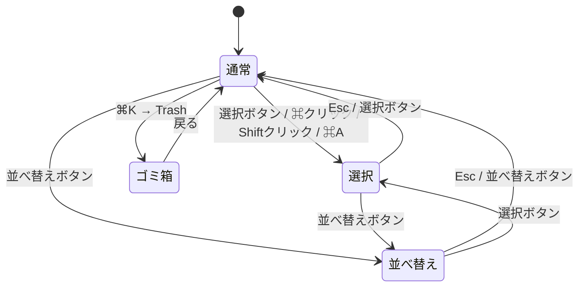
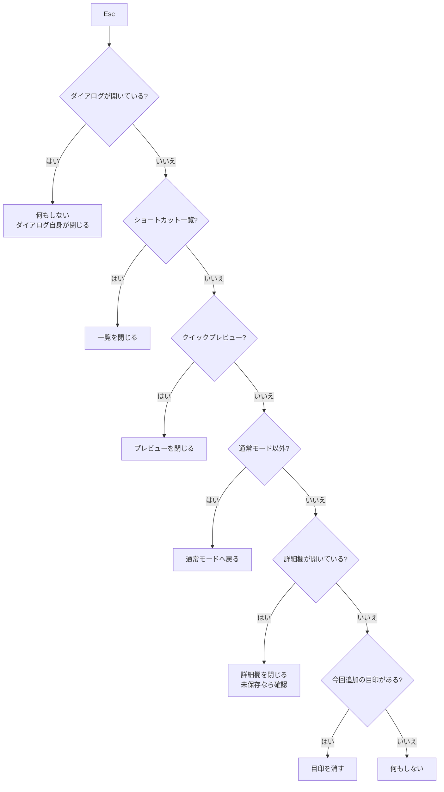
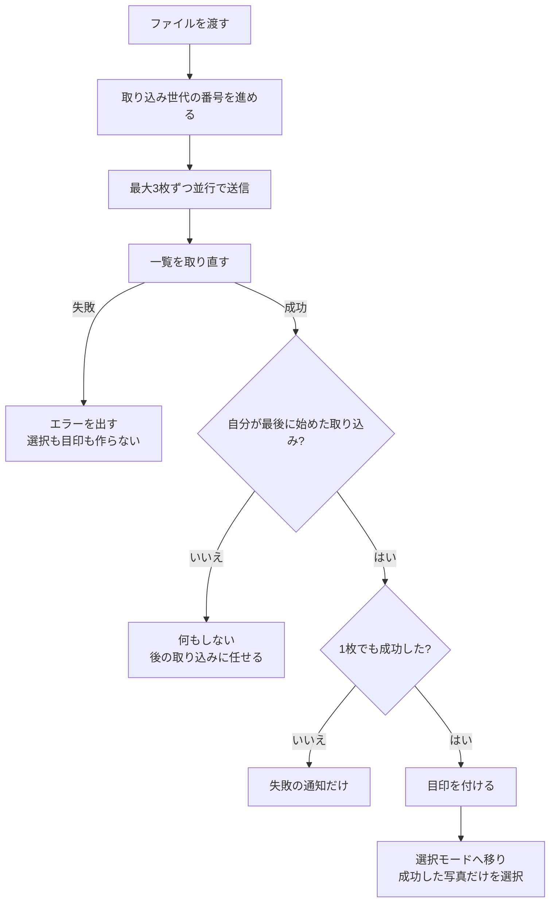

# Library の状態遷移と、スマホで届かない操作

管理画面 Library の「いま何ができる状態か」を一枚にした資料。
新しい機能（束の表示）を足す前に、既存の状態がどう繋がっているかを確定させておく。

**この文書は現状の記録であって、変更の提案ではない。** 直すべき点は末尾に分類してある。

コードの場所: `packages/web/src/web/pages/admin.tsx`

---

## 1. 3つのモード

モードが変わるとき、**必ず**次が起きる（`applyLibraryMode`、3655行）:

- 選択が全部消える
- クイックプレビューが閉じる
- 一括変更のメニューが閉じる
- ドラッグ中の状態が消える
- 通常モード以外へ移る時は、写真の詳細欄も閉じる

**未保存の編集がある時だけ、移る前に確認ダイアログが出る**（`requestLibraryMode`、3672行）。
確認を出す条件は「通常モード以外へ移る」かつ「詳細欄が開いている」かつ「編集済み」。

ゴミ箱を開くと、モードは無条件で通常へ戻る（1910行付近）。ここは確認を通さない。

---

## 2. 写真をクリックした時に何が起きるか

`handlePhotoClick`（3714行）。

| モード | 修飾キー | 起きること |
|---|---|---|
| 並べ替え | 何でも | **何も起きない** |
| 通常 | なし | 詳細欄が開く（未保存なら確認） |
| 通常 | ⌘ / Ctrl | 選択モードへ移り、その1枚を選択 |
| 通常 | Shift | 選択モードへ移り、直前クリックからの範囲を選択 |
| 選択 | なし | その1枚の選択を入り切り |
| 選択 | Shift | 直前クリックからの範囲を選択 |

---

## 3. 重なりものを閉じる順番（Esc）

4026行付近。上から順に、当てはまった1つだけを実行して終わる。

**入力欄に文字を打っている間は、Escは何もしない。**

---

## 4. 取り込み（アップロード）の着地

`handleFiles`。1枚ずつ送り、全部終わってから一覧を取り直す。

**重要な性質:**

- 重複と失敗は選択にも目印にも入らない
- 一覧の取り直しに失敗したら、選択モードへ移らない（第1A監査 F3）
- 取り込みが重なった時は、**最後に始めた回だけ**が着地する（同 F2）
- 着地時に詳細欄を未保存で開いていたら、確認ダイアログが出る（同 F1）
- **画面はスクロールしない。** 新しい写真は `sort_order` の最後に入るので、
  既定の並び順では496枚の一番下にいる（`docs/specs/library-band-decisions.md` 判断1）

---

## 5. スマホで届かない操作

Library には**タッチ専用の処理が1つも無い**。長押しもスワイプも実装されていない
（`admin.tsx` に `onTouchStart` / `touchstart` は存在しない）。
そのため、キーボードと修飾キーだけで届く操作はスマホから使えない。

| 操作 | PCでの方法 | スマホから | 影響 |
|---|---|---|---|
| クイックプレビュー | Space | **不可** | 写真を大きく確認する手段が詳細欄しかない |
| 1枚だけ選んで選択モードへ | ⌘クリック | 不可 | 選択ボタンを押してから写真を押す（2手） |
| 範囲選択 | Shiftクリック | **不可** | 連続した写真をまとめて選べない |
| 全選択 | ⌘A | **不可** | 1枚ずつ押す |
| 選択解除・モード終了 | Esc | 不可 | ボタンを押す |
| 左右回転 | `[` `]` | **不可** | 詳細欄から |
| ゴミ箱を開く | ⌘K | 不可 | メニューから |

**分類:** これは不具合ではなく、スマホ用の入り口を作っていないだけ。
どれを足すかは使い方の判断が要る（例: 長押しで選択モードは一般的だが、
スクロール中の誤爆と両立させる調整が必要）。

---

## 6. 既存テストが守っていない挙動

smokeとunitを読んだ範囲で、テストが無い、または実行時に飛ぶもの。

| 挙動 | 状態 |
|---|---|
| ゴミ箱を開くとモードが通常へ戻る（確認なし） | ゴミ箱が持ち越されない点は `admin-trash-signal.spec.ts` が守るが、**モードと選択が消える点は未検証** |
| 並べ替えモードで写真クリックが無反応 | テストなし |
| Space のクイックプレビュー切り替え | テストなし |
| モード変更時にドラッグ状態が消える | テストなし |
| 写真の枚数に依存して飛ぶsmoke | 実行のたびに件数が変わる（下記） |

**smokeの成功件数は安定しない。** `test.skip(count < 2, ...)` のように、
その時DBにある写真の枚数で飛ぶテストが複数ある。実測で 52 → 51 と変動した。
「落ちた」と「そもそも走らなかった」を混同しないよう、失敗の記録には
飛んだテスト名も残すようにした（`scripts/smoke/evidence-reporter.ts`）。

---

## 7. 見つけたことの分類

### A. 今回安全に直せる明確な問題 — 対応済み

- 取り込み完了時に古い詳細欄の値を見て、未保存の編集を黙って捨てていた（F1）
- 取り込みが重なると、先に始めた回が後の回を上書きしていた（F2）
- 一覧の取り直しに失敗しても選択モードへ移り「絞り込みの外」と誤表示していた（F3）
- 目印が読み上げに出ていなかった（F4）
- Esc で目印を消す処理が、他のEsc処理と二重に動いていた
- smoke失敗の証拠が次の実行で消えていた

### B. オーナーが画面を見てから決めるもの

- 取り込み後に一覧をどう動かすか（判断1）
- 目印の2pxの線の強さ、形、色
- Esc で目印を消す段が最後でよいか
- 「今回追加した◯枚を選択中」の文言

### C. 将来案として残すもの

- スマホの長押しで選択モードへ入る
- スマホのクイックプレビュー（いまSpaceのみ）
- スマホの範囲選択・全選択
- 手で束を作り直す機能とそのDB設計（判断2）
- 束の見せ方（B-3、判断3）
- 束の長さの上限（判断4）
- ゴミ箱を開く時に未保存の編集を確認するか

---

## 関連

- `docs/specs/library-band-decisions.md` — オーナー判断が必要な項目と実測値
- `docs/specs/admin-renewal-goal.md` — 管理画面刷新の目的（正本）
- `docs/specs/library-redesign-spec.md` — Library の下位仕様
